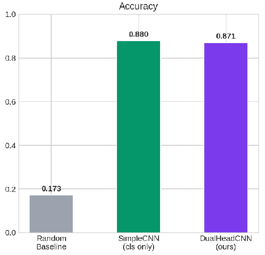

# Multi-Task CNN for Traffic Light Recognition and Localization

A CNN that classifies a traffic light's state (red, green, yellow, off, wait_on) and predicts its bounding box at the same time, trained on the S2TLD dataset (5,786 images).
Deep Learning course project, Middle East Technical University (ODTÜ), spring 2026.

**Best result:** 88.8% accuracy and 0.875 weighted F1 with a pretrained ResNet50. Adding localization costs only 0.9 points of accuracy. Box regression fails on such small objects (about 5×15 px); the report analyses why.

📄 [Report](IEEE_DEEP_LEARNING-2.pdf) · 📓 [Notebook](DI_project.ipynb)

**Stack:** PyTorch · torchvision · NumPy · matplotlib
